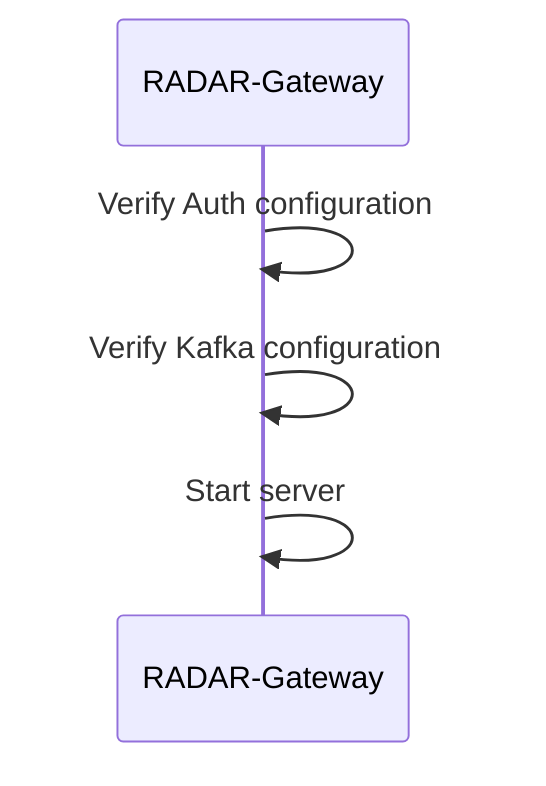
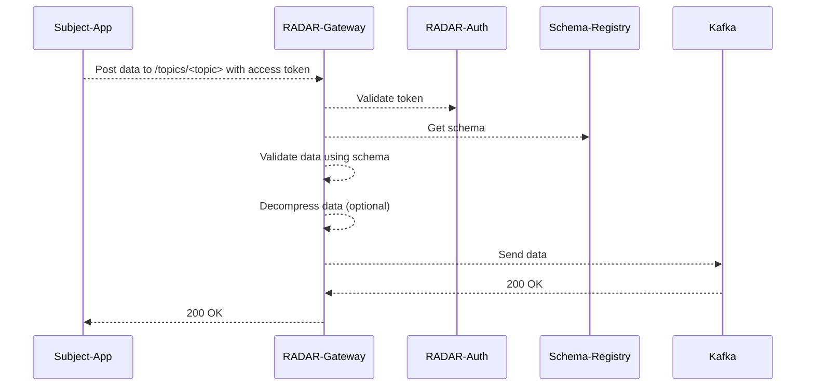

# RADAR-Gateway

REST Gateway to the Apache Kafka, similar to the REST Proxy provided by Confluent. In addition, it does authentication and authorization, content validation and decompression if needed. It is available as a [docker image](https://hub.docker.com/r/radarbase/radar-gateway).

## Configuration

The [RADAR-Auth] library is used for authentication and authorization of users. Refer to the documentation there for a full description of the configuration options.

## Usage

Start the REST Proxy with

```shell
docker-compose up -d --build
```

then once `kafka-1` is ready, create topics with

```shell
TOPIC=test
docker-compose exec kafka-1 kafka-topics --create --topic $TOPIC --bootstrap-server kafka-1:9092
```

Now the gateway is accessible through <http://localhost:8090/radar-gateway/> and the [ManagementPortal] is available through <http://localhost:8080/managementportal/>

The access token should be generated by the aforementioned Management portal. The access token is a JWT (JSON Web Token) that should contain the `MEASUREMENT.CREATE` scope for resource `res_gateway`, and list all applicable sources to submit data for. The gateway does content validation for posted data. It requires to use the Avro format with JSON serialization, using the `application/vnd.kafka.avro.v1+json` or `application/vnd.kafka.avro.v2+json` media types, as described in the [REST Proxy documentation].  It also requires messages to have both a key and a value with schemas. The key should have a `userId` and `sourceId` field. The `userId` should match the `sub` field in the OAuth2 JWT access token. That JWT should also contain a `sources` array claim which should contain the given `sourceId`. Sources can be added in the ManagementPortal or be generated by the app dynamically and then registered with the ManagementPortal.

Now you can access the gateway:
```shell
TOKEN=<access token from management portal>
curl -H "Authorization: Bearer $TOKEN" http://localhost:8090/radar-gateway/topics
```

Data compressed with GZIP is decompressed if the `Content-Encoding: gzip` header is present. With `curl`, use the `-H "Content-Encoding: gzip" --data-binary @data.json.gz` flags. It can be activated in `radar-commons` Java `RestClient` by setting `RestClient.Builder.gzipCompression(true)`. Likewise it accepts Apple LZFSE encoded data by adding the header `Content-Encoding: lzfse`.

Otherwise, it accepts all the same Avro messages and headers as specified in the Kafka [REST Proxy documentation].

Finally, the gateway accepts a custom binary format for data ingestion. The data must follow the binary Avro serialization of the [RecordSet schema](https://github.com/RADAR-base/RADAR-Schemas/blob/master/commons/kafka/record_set.avsc). Data in this format can be posted by using the content type `application/vnd.radarbase.avro.v1+binary`. It will construct an `ObservationKey` based on the user data in the `RecordSet`, and read the binary data values using the schema version provided in the `RecordSet`. This data sending mode can be activated in Java by using radar-commons `RestSender.Builder.useBinaryContent(true)`. Using binary mode has the added benefit of having a much more efficient GZIP encoding for many datasets.

[REST Proxy documentation]: https://docs.confluent.io/current/kafka-rest/api.html
[RADAR-Auth]: https://github.com/RADAR-base/ManagementPortal/tree/master/radar-auth
[ManagementPortal]: https://github.com/RADAR-base/ManagementPortal

## Flow

The gateway is a simple component which forwards requests to Kafka. It requires an access token with `MEASUREMENT.CREATE` scope for the `res_gateway` resource. The flow is as follows:

### Initialization

Initialization is limited to startup of the container and loading/validating configurations such as the Kafka configuration and the RADAR-Auth configuration.



### Regular operation

Data ingestion is done by posting data to the gateway. The gateway will validate the data and forward it to Kafka, after optional decompressing


